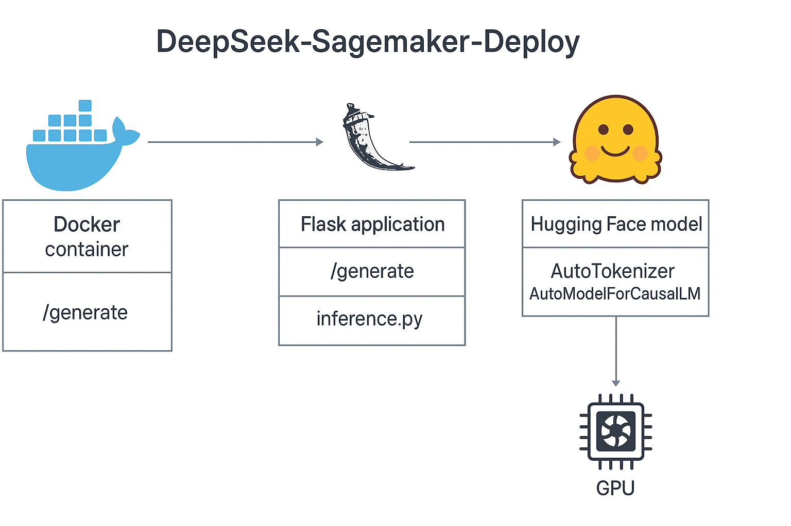

# DeepSeek Model Deployment 🚀

This repository provides a structured setup to run a Hugging Face LLM (e.g., DeepSeek) both locally via Docker and in the cloud using AWS SageMaker. You can use this project to quickly spin up an endpoint for inference on your own hardware or a cloud instance.

## 🗂 Project Structure

```
deepseek-sagemaker-deploy/
├── inference/
│   └── inference.py         # Flask API for model inference
├── requirements.txt         # Python dependencies
├── Dockerfile               # Dockerfile for local deployment
├── deploy_hf_model.py       # Python script to deploy using SageMaker HF container
└── model/ (optional local model files)
```

---

## ⚙️ Local Deployment

### ✅ Requirements

- Docker installed and running
- Python 3.8+ (optional for development)
- Hugging Face model files (in `/model` directory)

### 🧪 Steps

1. **Clone the repository**
   ```bash
   git clone https://github.com/Jdurairaj-hub/deepseek-sagemaker-deploy.git
   cd deepseek-sagemaker-deploy
   ```

2. **Build Docker image**
   ```bash
   docker build -t deepseek-api .
   ```

3. **Run the container**
   ```bash
   docker run --gpus all -p 9090:8080 deepseek-api
   ```

4. **Send a request**
   ```bash
   curl -X POST http://localhost:9090/generate \
     -H "Content-Type: application/json" \
     -d "{\"prompt\": \"What is the capital of Japan?\"}"
   ```

### 🖼 Local Deployment Architecture



---

## ☁️ AWS SageMaker Deployment

### ✅ Prerequisites

- AWS CLI configured with credentials
- IAM Role with the following permissions:
  - `AmazonSageMakerFullAccess`
  - `AmazonS3FullAccess`
- A bucket created (e.g., `my-deepseek-models-bucket`)
- Upload your model files to:
  ```
  s3://my-deepseek-models-bucket/model/
  ```

### 🧱 Setup

1. **Install dependencies**
   ```bash
   pip install sagemaker boto3
   ```

2. **Update IAM Role in `deploy_hf_model.py`**
   ```python
   role = "arn:aws:iam::<your-account-id>:role/<your-sagemaker-execution-role>"
   ```

3. **Run the deploy script**
   ```bash
   python deploy_hf_model.py
   ```

4. **Test endpoint**
   Once deployed, you can invoke the SageMaker endpoint using:

   ```python
   from sagemaker.huggingface import HuggingFacePredictor
   predictor = HuggingFacePredictor(endpoint_name="deepseek-endpoint")
   response = predictor.predict({"inputs": "What is the capital of Japan?"})
   print(response)
   ```

### 🖼 AWS Deployment Architecture


---

## 📦 Cleanup

To avoid extra costs, delete your SageMaker endpoint and model:
```bash
predictor.delete_endpoint()
```

---

## 📌 Notes

- This repo uses the Hugging Face DLC in SageMaker for cost-effective, no-docker deployment.
- For large models, using GPU-backed instances (like `ml.g5.xlarge`) is recommended.
- Use `ml.t2.medium` for CPU testing (very limited performance).

---

## 👨‍💻 Author

Maintained by [@Jdurairaj-hub](https://github.com/Jdurairaj-hub)
